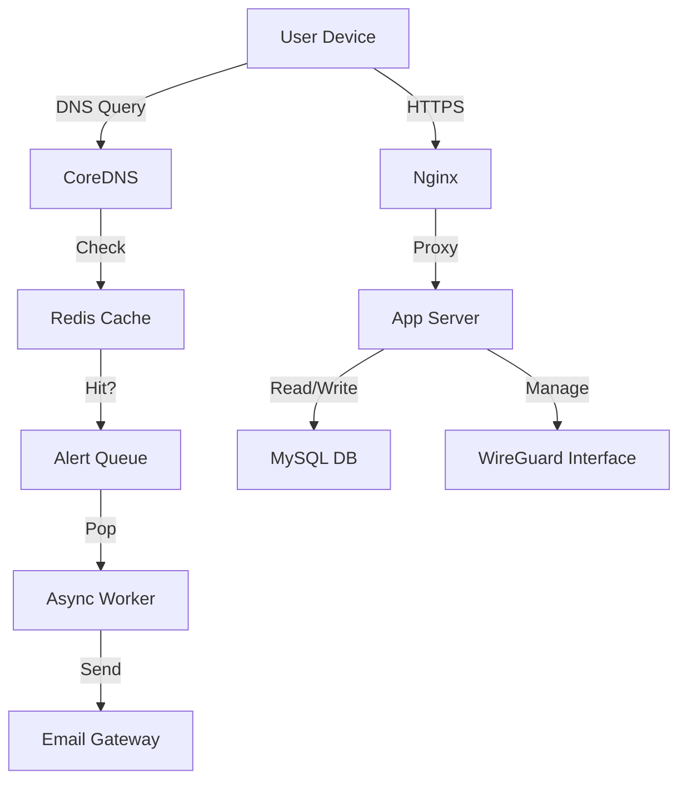

# GeekSTunnel - Enterprise VPN Control Plane

**GeekSTunnel** is a commercial-grade, high-performance WireGuard VPN management system designed for enterprise security, compliance, and ease of use.


## 🚀 Key Features

### 🛡️ Security & Hardening
-   **Admin 2FA (TOTP):** Secure the admin console with Time-based One-Time Passwords (Google Authenticator).
-   **Fail2Ban Integration:** Automatic IP banning after 3 failed admin login attempts.
-   **Strict ACLs:** Granular access control (Internet-only, Intranet-only, Full Access).
-   **Persistent Keys:** Private keys are securely stored in the database (MySQL) for consistent user experience.

### ⚡ High-Performance Architecture
-   **Real-time URL Alerting:** Monitor and alert on restricted site access (e.g., Social Media) with **Zero Latency** using Redis & CoreDNS.
-   **Hybrid Database:** MySQL for core data + Redis for high-speed caching and alert queues.
-   **Async Workers:** Email sending and heavy lifting are decoupled from the main request path.

### 📱 Fluid UI (v3.3.0)
-   **Mobile-First Design:** Fully responsive dashboard that works perfectly on phones, tablets, and desktops.
-   **Glassmorphism Aesthetic:** Modern, dark-mode UI with blur effects and smooth animations.
-   **QR Code Provisioning:** Instant mobile onboarding via QR codes.

### 🆔 Advanced Onboarding
-   **Identity Verification:** Invite users via Email.
-   **OTP Verification:** Users must verify their email with a One-Time Password before receiving their VPN config.

## 🛠️ Installation

### Prerequisites
-   Ubuntu 20.04/22.04 LTS
-   Root access
-   Domain name pointing to the server

### Quick Start (Automated)

```bash
# 1. Clone the repository
git clone https://github.com/geekcoderr/vpn-control.git /opt/vpn-control
cd /opt/vpn-control

# 2. Run the setup script
sudo ./setup.sh
```

The setup script will:
-   Install all dependencies (Python, Nginx, Redis, WireGuard, etc.).
-   Configure the database and virtual environment.
-   Set up Nginx with SSL (Let's Encrypt).
-   Install and configure Fail2Ban.
-   Start the systemd services.

## ⚙️ Configuration

Configuration is managed in `/opt/vpn-control/app/config.py`.

| Variable | Description | Default |
|----------|-------------|---------|
| `VPN_SERVER_ENDPOINT` | Public Hostname:Port | `wg.example.com:51820` |
| `VPN_SUBNET` | Internal VPN Subnet | `10.50.0.0/24` |
| `REDIS_HOST` | Redis Host | `127.0.0.1` |
| `SMTP_SERVER` | SMTP Server for Emails | `smtp.gmail.com` |

## 👥 Admin Management

**Default Credentials:**
-   **Username:** `geek`
-   **Password:** `ChangeMeNow123!`

**Reset Password:**
```bash
cd /opt/vpn-control
sudo ./venv/bin/python3 reset_password.py --username admin --password NewStrongPassword
```

## 🔍 Architecture



## 📜 License

Proprietary / Enterprise License.
Copyright © 2026 GeekSTunnel.
