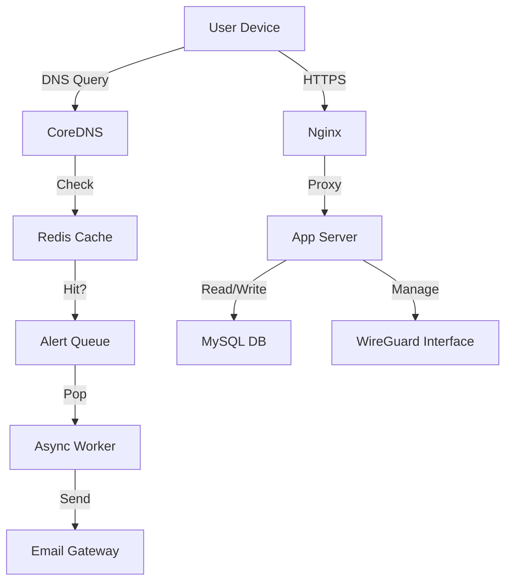

# GeekSTunnel - Enterprise VPN Control Plane

**GeekSTunnel** is a commercial-grade, high-performance WireGuard VPN management system designed for enterprise security, compliance, and ease of use.


## 🚀 Key Features

### 🛡️ Security & Hardening
-   **Admin 2FA (TOTP):** Secure the admin console with Time-based One-Time Passwords.
-   **Rate Limiting:** Protection against brute-force attacks on login endpoints.
-   **CSRF Protection:** Secure API interactions against cross-site request forgery.
-   **Fail2Ban Integration:** Automatic IP banning after 3 failed admin login attempts.
-   **Strict ACLs:** Granular access control (Internet-only, Intranet-only, Full Access).

### ⚡ High-Performance Architecture
-   **Military-Grade DNS Enforcement:** Forced DNS hijacking via iptables DNAT. Blocks DoT, IPv6 DNS, and custom client DNS.
-   **TCP BBR & Kernel Tuning:** Optimized for high-throughput and low-latency mesh networking.
-   **Hybrid Database:** MySQL for core data + Redis for high-speed caching.

### 📱 Premium UI (v4.0.0)
-   **Collapsible Sidebar:** Streamlined navigation for Dashboard, Settings, and Restricted Domains.
-   **Real-time Search:** Instant node filtering by name, IP, or endpoint.
-   **Adaptive Resource Management:** UI automatically enters idle mode when the tab is hidden to save server CPU.
-   **Glassmorphism Aesthetic:** Modern, dark-mode UI with blur effects and smooth animations.

### 🆔 Advanced Onboarding
-   **Identity Verification:** Invite users via Email.
-   **OTP Verification:** Users must verify their email with a One-Time Password before receiving their VPN config.

## 🛠️ Installation

### Prerequisites
-   Ubuntu 20.04/22.04 LTS
-   Root access
-   Domain name pointing to the server

### Quick Start (Automated)
```bash
# 1. Clone the repository
git clone https://github.com/geekcoderr/vpn-control.git /opt/vpn-control
cd /opt/vpn-control

# 2. Run the setup script
sudo ./setup.sh
```

### 🔄 Updating to v4.0.0
If you are already running an older version, follow these steps to upgrade:

```bash
cd /opt/vpn-control
git pull origin main

# 1. Install new security dependencies
sudo ./venv/bin/pip install -r requirements.txt

# 2. Apply Speed Optimizations (BBR + Kernel Tuning)
sudo chmod +x optimize_speed.sh
sudo ./optimize_speed.sh

# 3. Restart services
sudo systemctl restart vpn-control
```

## ⚙️ Configuration

Configuration is managed in `/opt/vpn-control/app/config.py`.

| Variable | Description | Default |
|----------|-------------|---------|
| `VPN_SERVER_ENDPOINT` | Public Hostname:Port | `wg.example.com:51820` |
| `VPN_SUBNET` | Internal VPN Subnet | `10.50.0.0/24` |
| `REDIS_HOST` | Redis Host | `127.0.0.1` |
| `SMTP_SERVER` | SMTP Server for Emails | `smtp.gmail.com` |

## 👥 Admin Management

**Default Credentials:**
-   **Username:** `geek`
-   **Password:** `ChangeMeNow123!`

**Reset Password:**
```bash
cd /opt/vpn-control
sudo ./venv/bin/python3 reset_password.py --username admin --password NewStrongPassword
```

## 🔍 Architecture



## 📜 License

Proprietary / Enterprise License.
Copyright © 2026 GeekSTunnel.
