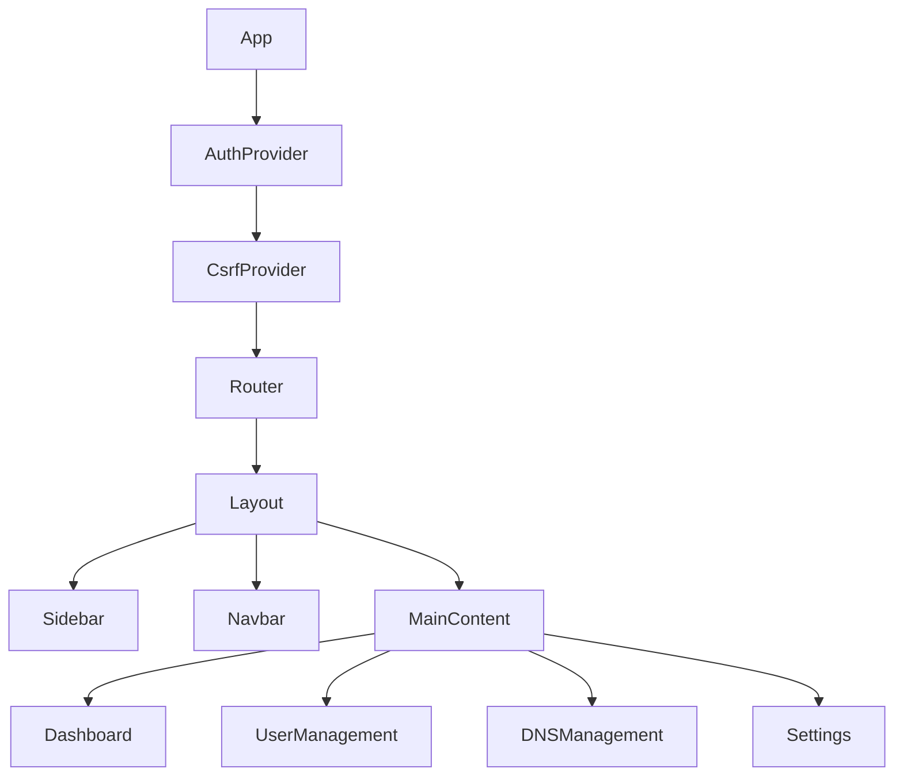

# GeekSTunnel: React.js Migration Blueprint

## 1. Executive Summary
This document outlines the strategic plan for migrating the GeekSTunnel vanilla HTML/JS frontend to a modern React.js architecture. The goal is to enhance maintainability, performance, and developer experience while preserving the "Cyber-Glass Premium" aesthetic and robust security features.

---

## 2. Technical Stack
- **Framework**: React 18+ (Functional Components with Hooks)
- **Build Tool**: Vite (for lightning-fast HMR and optimized builds)
- **Routing**: React Router v6
- **State Management**: React Context API (for Auth/CSRF) + Local State
- **Icons**: Lucide-React (SVG-based, matching current design)
- **Animations**: Framer Motion (for premium glassmorphism transitions)
- **HTTP Client**: Axios (with interceptors for CSRF/Auth)

---

## 3. Architecture Overview

### 3.1 Component Hierarchy

### 3.2 Key Components
- **GlassCard**: A reusable wrapper component implementing the `backdrop-filter: blur(12px)` and semi-transparent border styles.
- **StatCard**: Specialized card for displaying real-time metrics (CPU, RAM, Bandwidth).
- **UserTable**: Interactive table with sorting, filtering, and bulk actions.
- **DNSManager**: Interface for blacklist management and troubleshooting.

---

## 4. Security Implementation

### 4.1 CSRF Protection
- **Strategy**: Fetch a CSRF token on app initialization and store it in a `CsrfContext`.
- **Injection**: Use an Axios interceptor to automatically add the `X-CSRF-Token` header to all `POST`, `PUT`, `PATCH`, and `DELETE` requests.

### 4.2 WebSocket Authentication
- **Mechanism**: The `useWebSocket` hook will establish a connection to `/ws/stats`.
- **Validation**: The backend will validate the session cookie during the WebSocket handshake. If invalid, the connection is closed with code `4001`.

### 4.3 Protected Routes
- Implement a `ProtectedRoute` component that checks the `useAuth` state. If the user is not authenticated, they are redirected to `/login`.

---

## 5. Migration Phases

### Phase 1: Foundation
- Initialize Vite project.
- Port global CSS variables and "Cyber-Glass" design system.
- Setup `AuthProvider` and `CsrfProvider`.

### Phase 2: Core UI
- Build the `Layout` (Sidebar/Navbar).
- Implement the `Dashboard` with live metrics polling/websockets.

### Phase 3: Feature Porting
- Port User Management (CRUD operations).
- Port DNS Blacklist management.
- Implement 2FA setup and verification flows.

### Phase 4: Optimization & Security
- Implement HSTS and CSP headers via Nginx.
- Enable production-grade rate limiting.
- Final UI/UX polish.

---

## 6. Deployment Strategy
1. **Build**: Run `npm run build` to generate the `dist` folder.
2. **Nginx Integration**: Update `nginx-ssl.conf` to serve the `dist` folder as the root.
3. **Fallback**: Ensure Nginx handles SPA routing by redirecting all non-file requests to `index.html`.

---

**Prepared for**: GeekSTunnel Development Team
**Version**: 1.0.0
**Date**: January 2026
